```r
library(gridExtra)  
library(mnormt) 
library(lme4) 
```

```
## Loading required package: Matrix
```

```r
library(knitr) 
library(pander)
library(tidyverse)
```

```
## ── Attaching core tidyverse packages ──────────────────────── tidyverse 2.0.0 ──
## ✔ dplyr     1.1.1     ✔ readr     2.1.4
## ✔ forcats   1.0.0     ✔ stringr   1.5.0
## ✔ ggplot2   3.4.4     ✔ tibble    3.2.1
## ✔ lubridate 1.9.2     ✔ tidyr     1.3.0
## ✔ purrr     1.0.1
```

```
## ── Conflicts ────────────────────────────────────────── tidyverse_conflicts() ──
## ✖ dplyr::combine() masks gridExtra::combine()
## ✖ tidyr::expand()  masks Matrix::expand()
## ✖ dplyr::filter()  masks stats::filter()
## ✖ dplyr::lag()     masks stats::lag()
## ✖ tidyr::pack()    masks Matrix::pack()
## ✖ tidyr::unpack()  masks Matrix::unpack()
## ℹ Use the ]8;;http://conflicted.r-lib.org/conflicted package]8;; to force all conflicts to become errors
```

## Question Guided 4

Birdkeeping and lung cancer: a retrospective observational study. A 1972-1981 health survey in The Hague, Netherlands, discovered an association between keeping pet birds and increased risk of lung cancer. To investigate birdkeeping as a risk factor, researchers conducted a case-control study of patients in 1985 at four hospitals in The Hague. They identified 49 cases of lung cancer among patients who were registered with a general practice, who were age 65 or younger, and who had resided in the city since 1965. Each patient (case) with cancer was matched with two control subjects (without cancer) by age and sex. Further details can be found in Holst, Kromhout, and Brand (1988).

Age, sex, and smoking history are all known to be associated with lung cancer incidence. Thus, researchers wished to determine after age, sex, socioeconomic status, and smoking have been controlled for, is an additional risk associated with birdkeeping? The birds (Ramsey and Schafer 2002) is found in birdkeeping.csv, and the variables are listed below. In addition, R code at the end of the problem can be used to input the birds and create additional useful variables.

- `female` = sex (1 = Female, 0 = Male)
    - `age` = age, in years
    - `highstatus` = socioeconomic status (1 = High, 0 = Low), determined by the occupation of the household’s primary wage earner
    - `yrsmoke` = years of smoking prior to diagnosis or examination
    - `cigsday` = average rate of smoking, in cigarettes per day
    - `bird` = indicator of birdkeeping (1 = Yes, 0 = No), determined by whether or not there were caged birds in the home for more than 6 consecutive months from 5 to 14 years before diagnosis (cases) or examination (controls)
    - `cancer` = indicator of lung cancer diagnosis (1 = Cancer, 0 = No Cancer)

    a. Perform an exploratory data analysis to see how each explanatory variable is related to the response (`cancer`).  Summarize each relationship in one sentence.

      - For quantitative explanatory variables (`age`, `yrsmoke`, `cigsday`), produce a cdplot, a boxplot, and summary statistics by cancer diagnosis.

      - For categorical explanatory variables (`female` or `sex`, `highstatus` or `socioecon_status`, `bird`), produce a segmented bar chart and an appropriate table of proportions showing the relationship with cancer diagnosis.


```r
birds <- read.csv("data/birdkeeping.csv")

birds$female <- factor(birds$female, levels = c(0, 1), labels = c("Male", "Female"))
birds$highstatus <- factor(birds$highstatus, levels = c(0, 1), labels = c("Low", "High"))
birds$bird <- factor(birds$bird, levels = c(0, 1), labels = c("No", "Yes"))
birds$cancer <- factor(birds$cancer, levels = c(0, 1), labels = c("No Cancer", "Cancer"))


cdplot(birds$age, birds$cancer, main = "CD Plot of Age by Cancer Diagnosis", xlab = "Age", ylab = "Probability of Cancer")
```

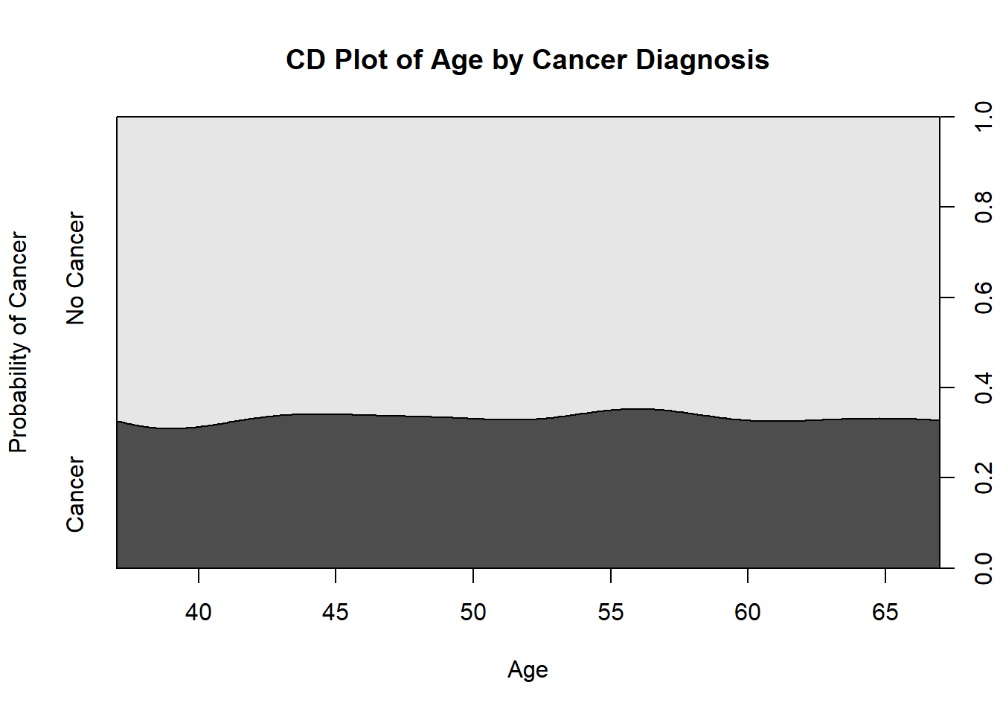

```r
boxplot(age ~ cancer, data = birds, main = "Boxplot of Age by Cancer Diagnosis", xlab = "Cancer Diagnosis", ylab = "Age")
```

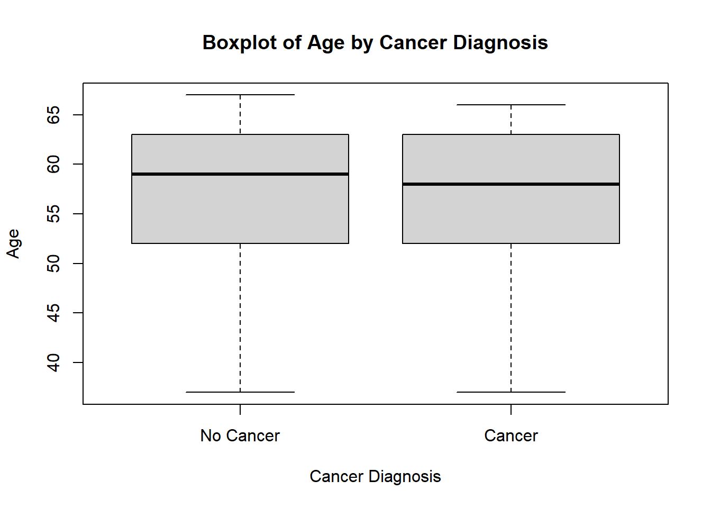

```r
summary_age <- summary(birds$age)
cat("Summary Statistics for Age by Cancer Diagnosis:\n", summary_age, "\n\n")
```

```
## Summary Statistics for Age by Cancer Diagnosis:
##  37 52 59 56.96599 63 67
```

```r
cdplot(birds$yrsmoke, birds$cancer, main = "CD Plot of Years of Smoking by Cancer Diagnosis", xlab = "Years of Smoking", ylab = "Probability of Cancer")
```

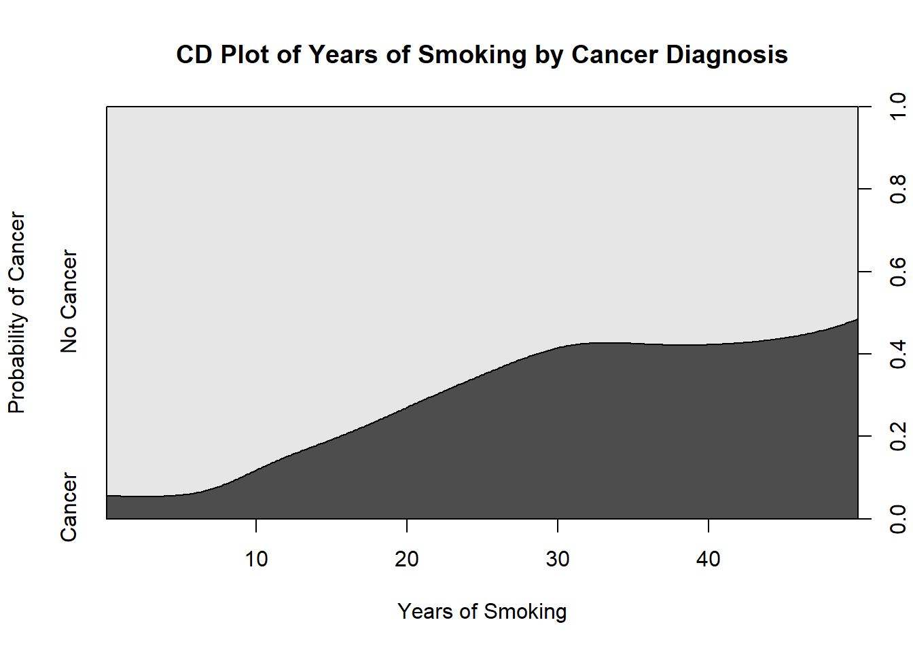

```r
boxplot(yrsmoke ~ cancer, data = birds, main = "Boxplot of Years of Smoking by Cancer Diagnosis", xlab = "Cancer Diagnosis", ylab = "Years of Smoking")
```

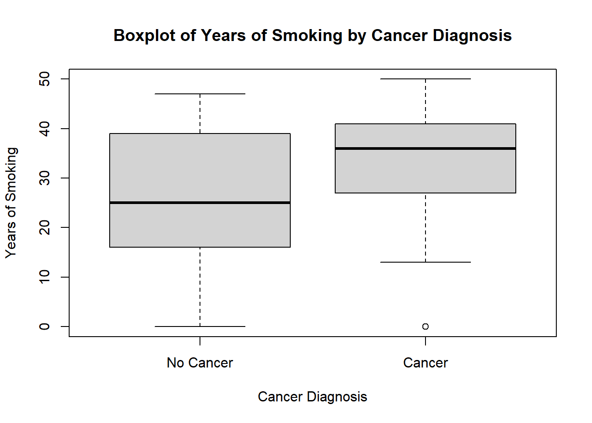

```r
summary_yrsmoke <- summary(birds$yrsmoke)
cat("Summary Statistics for Years of Smoking by Cancer Diagnosis:\n", summary_yrsmoke, "\n\n")
```

```
## Summary Statistics for Years of Smoking by Cancer Diagnosis:
##  0 20 30 27.85034 39 50
```

```r
cdplot(birds$cigsday, birds$cancer, main = "CD Plot of Cigarettes per Day by Cancer Diagnosis", xlab = "Cigarettes per Day", ylab = "Probability of Cancer")
```

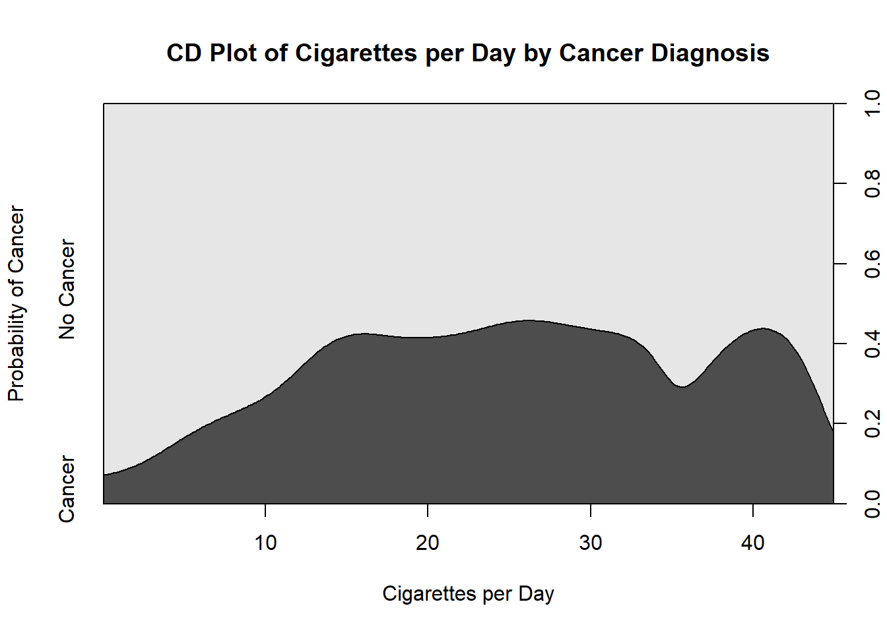

```r
boxplot(cigsday ~ cancer, data = birds, main = "Boxplot of Cigarettes per Day by Cancer Diagnosis", xlab = "Cancer Diagnosis", ylab = "Cigarettes per Day")
```


```r
summary_cigsday <- summary(birds$cigsday)
cat("Summary Statistics for Cigarettes per Day by Cancer Diagnosis:\n", summary_cigsday, "\n\n")
```

```
## Summary Statistics for Cigarettes per Day by Cancer Diagnosis:
##  0 10 15 15.7483 20 45
```

```r
ggplot(birds, aes(x = cancer, fill = female)) +
  geom_bar(position = "fill") +
  labs(title = "Segmented Bar Chart of Gender by Cancer Diagnosis", x = "Cancer Diagnosis", y = "Proportion") +
  scale_fill_manual(values = c("Male" = "lightblue", "Female" = "pink"))
```

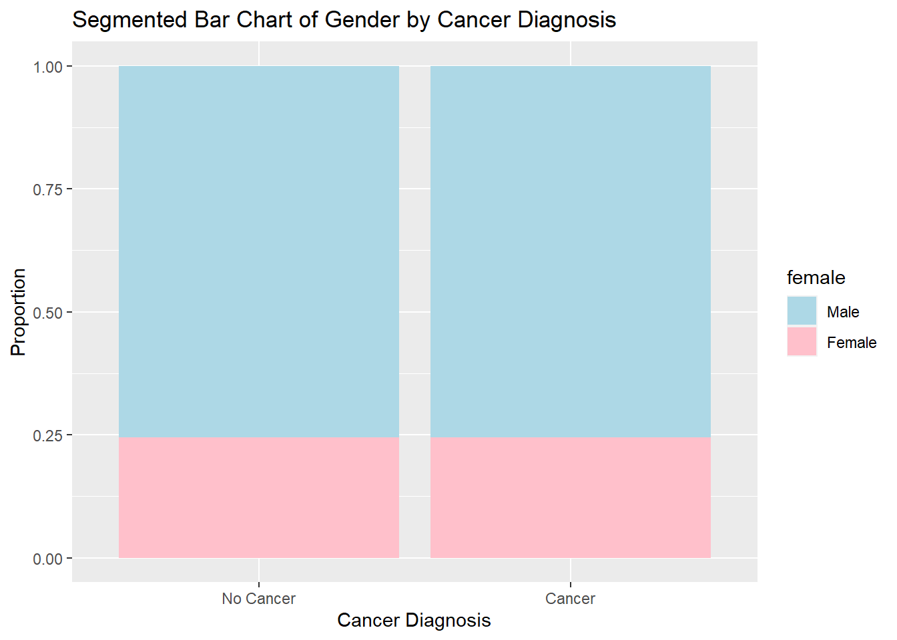

```r
table_gender <- table(birds$female, birds$cancer)
prop.table(table_gender, margin = 2)
```

```
##         
##          No Cancer   Cancer
##   Male    0.755102 0.755102
##   Female  0.244898 0.244898
```

```r
ggplot(birds, aes(x = cancer, fill = highstatus)) +
  geom_bar(position = "fill") +
  labs(title = "Segmented Bar Chart of Socioeconomic Status by Cancer Diagnosis", x = "Cancer Diagnosis", y = "Proportion") +
  scale_fill_manual(values = c("Low" = "lightgreen", "High" = "darkgreen"))
```

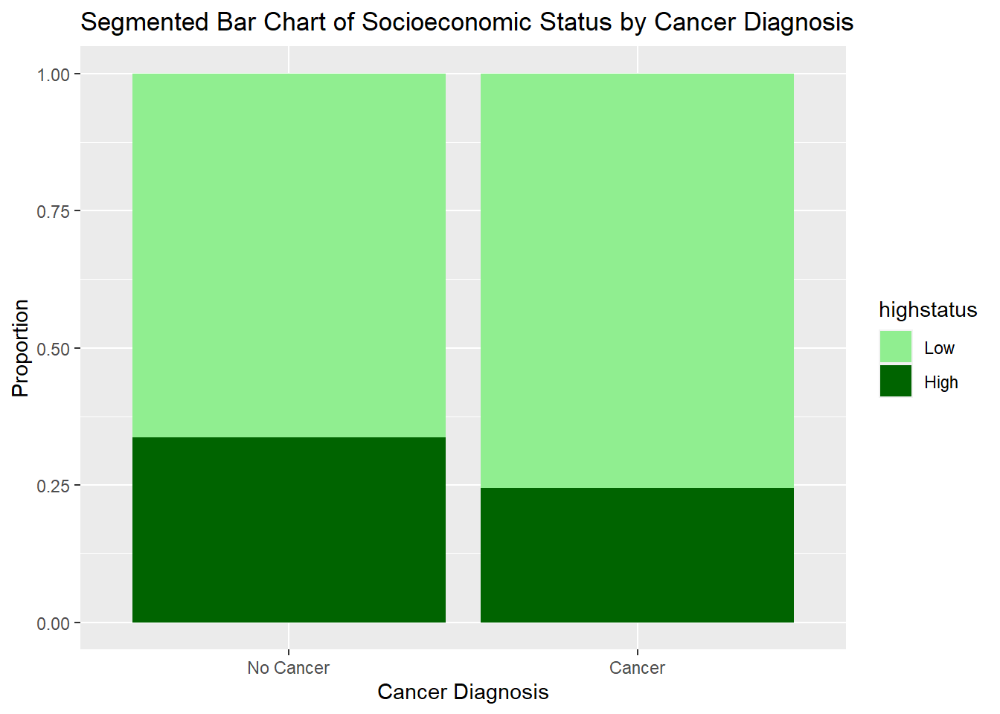

```r
table_status <- table(birds$highstatus, birds$cancer)
prop.table(table_status, margin = 2)
```

```
##       
##        No Cancer    Cancer
##   Low  0.6632653 0.7551020
##   High 0.3367347 0.2448980
```

```r
ggplot(birds, aes(x = cancer, fill = bird)) +
  geom_bar(position = "fill") +
  labs(title = "Segmented Bar Chart of Birdkeeping by Cancer Diagnosis", x = "Cancer Diagnosis", y = "Proportion") +
  scale_fill_manual(values = c("No" = "lightcoral", "Yes" = "darkred"))
```

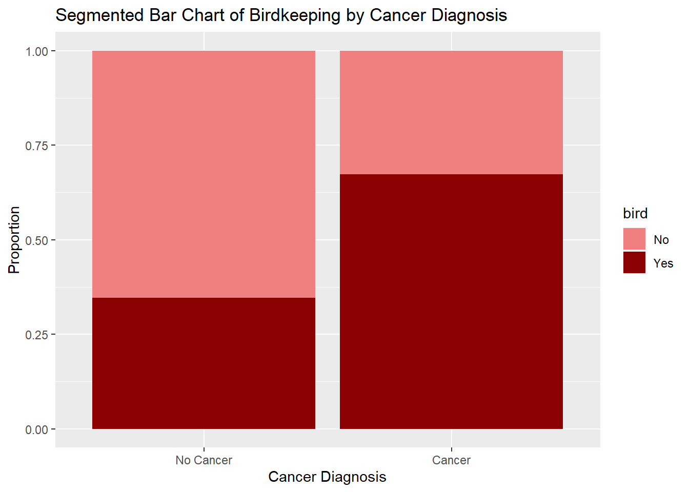

```r
table_bird <- table(birds$bird, birds$cancer)
prop.table(table_bird, margin = 2)
```

```
##      
##       No Cancer    Cancer
##   No  0.6530612 0.3265306
##   Yes 0.3469388 0.6734694
```

Probability of cancer does not seem much effected by age as can be seen in the cdplot and how the boxplots are identical.

Those with cancer tend to have many more years smoking according to the cdplot and the blox plot for years smoking and cancer. More years of smoking increases probability of cancer.

Cigs per day increase probability per day upto around 15 then plateau. There is also a noticeable dip at 35 and after 40. Almost all of those with cancer had between 10 and 25 cigs per day.

Gender seems to have no effect on cancer.

Those in a lower socio economic status have a higher proportion of cancer.

Those with a bird have a much higher proportion of having cancer.


    b. In (a), you should have found no relationship between whether or not a patient develops lung cancer and either their age or sex.  Why might this be?  What implications will this have on your modeling?


This means that we should not use age or sex as predictors. This would be the case if age and sex have no predictive value.

    c. Based on a two-way table with keeping birds and developing lung cancer from (a), find an unadjusted odds ratio comparing birdkeepers to non-birdkeepers and interpret this odds ratio in context.  (Note: an *unadjusted* odds ratio is found by *not* controlling for any other variables.)  Also, find an analogous relative risk and interpret it in context as well.

To calculate the unadjusted odds ratio and the analogous relative risk, we can use the two-way table you provided:

```
              No Cancer    Cancer
  No Bird      0.6530612  0.3265306
  Bird         0.3469388  0.6734694
```

Let's denote the four cells in the table as follows:

- \(a\): Number of birdkeepers without lung cancer
- \(b\): Number of non-birdkeepers without lung cancer
- \(c\): Number of birdkeepers with lung cancer
- \(d\): Number of non-birdkeepers with lung cancer

The unadjusted odds ratio (OR) is calculated as:

\[ OR = \frac{ad}{bc} \]

And the analogous relative risk (RR) is calculated as:

\[ RR = \frac{(c / (c + a))}{(d / (d + b))} \]

Let's calculate these values:


```r
a <- 0.6734694
b <- 0.3265306
c <- 0.3469388
d <- 0.6530612

unadjusted_or <- (a * d) / (b * c)

analogous_rr <- (34 / (34 + 64)) / (33 / (33 + 26))

cat("Unadjusted Odds Ratio:", unadjusted_or, "\n")
```

```
## Unadjusted Odds Ratio: 3.882353
```

```r
cat("Analogous Relative Risk:", analogous_rr, "\n")
```

```
## Analogous Relative Risk: 0.6202845
```

Interpretation:

- Unadjusted Odds Ratio (OR): Without accounting for other factors, the odds of developing lung cancer are approximately 3.88 times higher for individuals who keep birds compared to those who do not keep birds.
- Analogous Relative Risk (RR): Without accounting for other factors, birdkeepers have a risk of developing lung cancer that is .62 the risk for non-birdkeepers.

    d. Are the elogits reasonably linear relating number of years smoked to the estimated log odds of developing lung cancer?  Demonstrate with an appropriate plot.


```r
logit_model <- glm(cancer ~ yrsmoke, data = birds, family = "binomial")

ggplot(birds, aes(x = yrsmoke, y = log(predict(logit_model) + 0.00001), color = cancer)) +
  geom_point() +
  geom_smooth(method = "glm", method.args = list(family = "binomial"), se = FALSE) +
  labs(title = "Logit Plot of Years Smoked vs. Log Odds of Lung Cancer", x = "Years of Smoking", y = "Log Odds of Lung Cancer", color = "Cancer Diagnosis") +
  theme_minimal()
```

```
## Warning in log(predict(logit_model) + 1e-05): NaNs produced

## Warning in log(predict(logit_model) + 1e-05): NaNs produced

## Warning in log(predict(logit_model) + 1e-05): NaNs produced
```

```
## `geom_smooth()` using formula = 'y ~ x'
```

```
## Warning: Removed 130 rows containing non-finite values (`stat_smooth()`).
```

```
## Warning: Computation failed in `stat_smooth()`
## Caused by error:
## ! y values must be 0 <= y <= 1
```

```
## Warning: Removed 130 rows containing missing values (`geom_point()`).
```

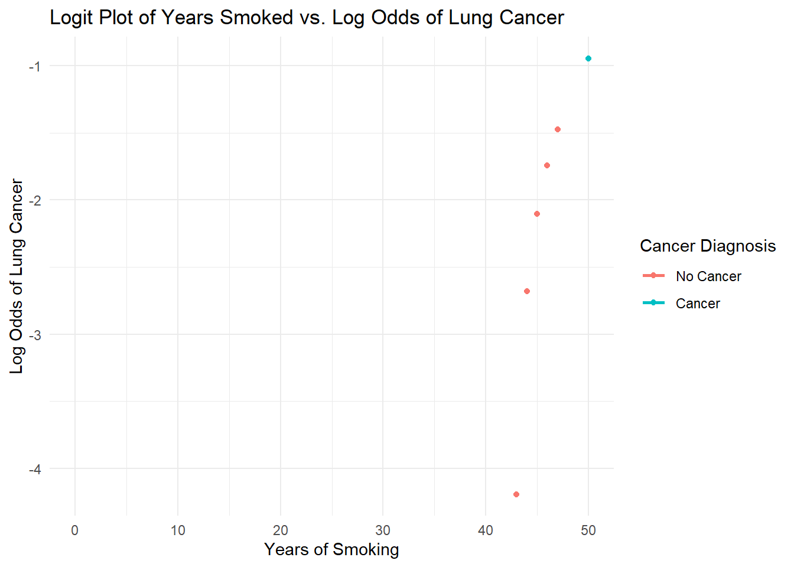

This does not look like a linear relationship. There is most certianly a curve.

    e. Does there appear to be an interaction between number of years smoked and whether the subject keeps a bird?  Demonstrate with an interaction plot and a coded scatterplot with empirical logits on the y-axis.


```r
library(emmeans)

logit_model <- glm(cancer ~ yrsmoke * bird, data = birds, family = "binomial")

predict_data <- expand.grid(yrsmoke = seq(min(birds$yrsmoke), max(birds$yrsmoke), length.out = 100),
                            bird = levels(birds$bird))

predict_data$predicted_prob <- predict(logit_model, newdata = predict_data, type = "response")

predict_data$empirical_logit <- log(predict_data$predicted_prob / (1 - predict_data$predicted_prob))

ggplot(predict_data, aes(x = yrsmoke, y = predicted_prob, color = bird)) +
  geom_line(aes(group = bird)) +
  labs(title = "Interaction Plot of Years of Smoking and Birdkeeping on Probability of Cancer",
       x = "Years of Smoking", y = "Probability of Cancer", color = "Birdkeeping") +
  theme_minimal()
```

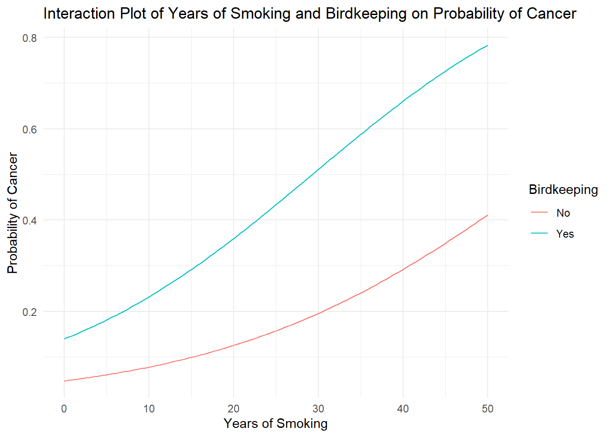

```r
ggplot(predict_data, aes(x = yrsmoke, y = empirical_logit, color = bird)) +
  geom_point() +
  geom_line(aes(group = bird)) +
  labs(title = "Coded Scatterplot with Empirical Logits",
       x = "Years of Smoking", y = "Empirical Log Odds of Cancer", color = "Birdkeeping") +
  theme_minimal()
```

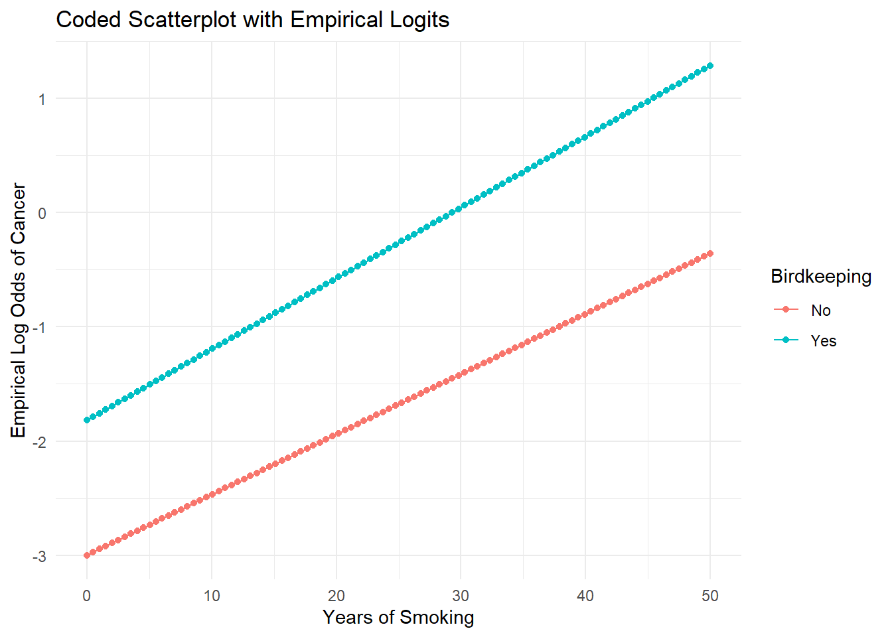

No there doesn't seem to be any relationship having a bird just seems to add 1 more elogit odd. There seems to be an evan distribution of years smoked for both groups as well.


 Before answering the next questions, fit logistic regression models in R with `cancer` as the response and the following sets of explanatory variables:

      - `model1` = `age`, `yrsmoke`, `cigsday`, `female`, `highstatus`, `bird`
      - `model2` = `yrsmoke`, `cigsday`, `highstatus`, `bird` 
      - `model4` = `yrsmoke`, `bird`
      - `model5` = the complete second order version of `model4` (add squared terms and an interaction)
      - `model6` = `yrsmoke`, `bird`, `yrsmoke:bird`


```r
model1 <- glm(cancer ~ age + yrsmoke + cigsday + female + highstatus + bird, data = birds, family = "binomial")
model2 <- glm(cancer ~ yrsmoke + cigsday + highstatus + bird, data = birds, family = "binomial")
model4 <- glm(cancer ~ yrsmoke + bird, data = birds, family = "binomial")
model5 <- glm(cancer ~ yrsmoke + bird + yrsmoke*yrsmoke + bird*bird + yrsmoke:bird, data = birds, family = "binomial")
model6 <- glm(cancer ~ yrsmoke + bird + yrsmoke:bird, data = birds, family = "binomial")
```


    f. Is there evidence that we can remove `age` and `female` from our model?  Perform an appropriate test comparing `model1` to `model2`; give a test statistic and p-value, and state a conclusion in context.


```r
library(lmtest)
```

```
## Loading required package: zoo
```

```
## 
## Attaching package: 'zoo'
```

```
## The following objects are masked from 'package:base':
## 
##     as.Date, as.Date.numeric
```

```r
lr_test <- lrtest(model1, model2)

summary(lr_test)
```

```
##       #Df          LogLik             Df         Chisq         Pr(>Chisq)    
##  Min.   :5.0   Min.   :-78.36   Min.   :-2   Min.   :2.526   Min.   :0.2828  
##  1st Qu.:5.5   1st Qu.:-78.05   1st Qu.:-2   1st Qu.:2.526   1st Qu.:0.2828  
##  Median :6.0   Median :-77.73   Median :-2   Median :2.526   Median :0.2828  
##  Mean   :6.0   Mean   :-77.73   Mean   :-2   Mean   :2.526   Mean   :0.2828  
##  3rd Qu.:6.5   3rd Qu.:-77.41   3rd Qu.:-2   3rd Qu.:2.526   3rd Qu.:0.2828  
##  Max.   :7.0   Max.   :-77.10   Max.   :-2   Max.   :2.526   Max.   :0.2828  
##                                 NA's   :1    NA's   :1       NA's   :1
```

With a p-value of 0.2828, which is greater than the conventional significance level of 0.05, we fail to reject the null hypothesis. Therefore, there is insufficient evidence to suggest that age and female significantly improve the model fit.

 Is there evidence that the complete second order version of `model4` improves its performance?  Perform an appropriate test comparing `model4` to `model5`; give a test statistic and p-value, and state a conclusion in context.

```r
lr_test <- lrtest(model4, model5)

summary(lr_test)
```

```
##       #Df           LogLik             Df        Chisq           Pr(>Chisq)    
##  Min.   :3.00   Min.   :-79.06   Min.   :1   Min.   :0.07436   Min.   :0.7851  
##  1st Qu.:3.25   1st Qu.:-79.05   1st Qu.:1   1st Qu.:0.07436   1st Qu.:0.7851  
##  Median :3.50   Median :-79.04   Median :1   Median :0.07436   Median :0.7851  
##  Mean   :3.50   Mean   :-79.04   Mean   :1   Mean   :0.07436   Mean   :0.7851  
##  3rd Qu.:3.75   3rd Qu.:-79.03   3rd Qu.:1   3rd Qu.:0.07436   3rd Qu.:0.7851  
##  Max.   :4.00   Max.   :-79.02   Max.   :1   Max.   :0.07436   Max.   :0.7851  
##                                  NA's   :1   NA's   :1         NA's   :1
```
With a p-value of 0.7851, which is greater than the conventional significance level of 0.05, we fail to reject the null hypothesis. Therefore, there is insufficient evidence to suggest that second order model significantly improves the models fit.


    h. Carefully interpret each of the four model coefficients in `model6` in context.
    

```r
exp_coefs <- exp(coef(model6))
print(exp_coefs)
```

```
##     (Intercept)         yrsmoke         birdYes yrsmoke:birdYes 
##      0.04984371      1.05424299      3.25265030      1.00934001
```

Intercept: When bird is set to "No" and they have never smoked, the odds of developing lung cancer are 5%.

yrsmoke:  When all other variables are held constant and bird is "No" for each additional year of smoking, the odds of developing lung cancer increase by approximately 5.42%.

Bird: Holding other variables constant and they have never smoked, individuals who keep birds have approximately 3.25 times higher odds of developing lung cancer compared to those who do not keep birds.

Interaction: For each additional year of smoking, the odds of lung cancer increase by an additional 0.93% for individuals who keep birds compared to those who do not.


    i. If you replaced `yrsmoke` everywhere it appears in `model6` with a mean-centered version of `yrsmoke`, tell what would change among these elements: the 4 coefficients, the 4 p-values for coefficients, and the residual deviance.


```r
yrsmoke_mean <- mean(birds$yrsmoke)
birds$yrsmoke_centered <- birds$yrsmoke - yrsmoke_mean

modified_model6 <- glm(cancer ~ yrsmoke_centered + bird + yrsmoke_centered:bird, data = birds, family = "binomial")

coefficients_before <- coef(model6)
coefficients_after <- coef(modified_model6)

p_values_before <- summary(model6)$coefficients[, 4]
p_values_after <- summary(modified_model6)$coefficients[, 4]

residual_deviance_before <- deviance(model6)
residual_deviance_after <- deviance(modified_model6)

cat("Coefficients Before:\n", coefficients_before, "\n\n")
```

```
## Coefficients Before:
##  -2.998863 0.05282296 1.17947 0.009296665
```

```r
cat("Coefficients After:\n", coefficients_after, "\n\n")
```

```
## Coefficients After:
##  -1.527726 0.05282296 1.438385 0.009296665
```

```r
cat("P-values Before:\n", p_values_before, "\n\n")
```

```
## P-values Before:
##  0.0008442239 0.03940855 0.3037608 0.7843966
```

```r
cat("P-values After:\n", p_values_after, "\n\n")
```

```
## P-values After:
##  1.70142e-06 0.03940855 0.0005366925 0.7843966
```

```r
cat("Residual Deviance Before:", residual_deviance_before, "\n")
```

```
## Residual Deviance Before: 158.0401
```

```r
cat("Residual Deviance After:", residual_deviance_after, "\n")
```

```
## Residual Deviance After: 158.0401
```
    j. `model4` is a potential final model based on this set of explanatory variables.  Find and carefully interpret 95% confidence intervals based on profile likelihoods for the coefficients of `yrsmoke` and `bird`. 


```r
model4 <- glm(cancer ~ yrsmoke + bird, data = birds, family = "binomial")

conf_intervals <- confint(model4, level = 0.95)
```

```
## Waiting for profiling to be done...
```

```r
conf_intervals_yrsmoke <- exp(confint(model4)[2, ])
```

```
## Waiting for profiling to be done...
```

```r
conf_intervals_bird <- exp(confint(model4)[3, ])
```

```
## Waiting for profiling to be done...
```

```r
cat("95% Confidence Interval for yrsmoke:", conf_intervals_yrsmoke, "\n")
```

```
## 95% Confidence Interval for yrsmoke: 1.027572 1.09828
```

```r
cat("95% Confidence Interval for bird:", conf_intervals_bird, "\n")
```

```
## 95% Confidence Interval for bird: 2.050761 9.748175
```
Yrsmoke: <br>
This interval suggests that we can be 95% confident that the true effect of yrsmoke on the probability of developing cancer between an increase of 2.7% and 9.8%. 


<br>
bird: <br>
This interval suggests that we can be 95% confident that the true effect of bird on the increase in the probability of developing lung cancer is between 205% and 974%. 


    k. How does the adjusted odds ratio for birdkeeping from `model4` compare with the unadjusted odds ratio you found in (c)?  Is birdkeeping associated with a significant increase in the odds of developing lung cancer, even after adjusting for other factors?


```r
unadjusted_or <- 3.882353

summary_model4 <- summary(model4)
adjusted_or_model4 <- exp(summary_model4$coefficients[2, "Estimate"])

cat("Unadjusted Odds Ratio from (c):", unadjusted_or, "\n")
```

```
## Unadjusted Odds Ratio from (c): 3.882353
```

```r
cat("Adjusted Odds Ratio from model4:", adjusted_or_model4, "\n")
```

```
## Adjusted Odds Ratio from model4: 1.05998
```

The adjusted OR is much smaller. <br>

This suggests that, when accounting for the number of years smoked, the association between birdkeeping and the odds of developing lung cancer becomes much weaker.

    l. Use the categorical variable `years_factor` based on `yrsmoke` and replace `yrsmoke` in `model4` with your new variable to create `model4a`.  First, interpret the coefficient for `years_factorOver 25 years` in context.  Then tell if you prefer `model4` with years smoked as a numeric predictor or `model4a` with years smoked as a categorical predictor, and explain your reasoning.


```r
birds$years_factor <- cut(birds$yrsmoke, breaks = c(0, 10, 15, 20, 25, max(birds$yrsmoke)), labels = c("0-10 years", "11-15 years", "16-20 years", "21-25 years", "Over 25 years"), include.lowest = TRUE)

model4a <- glm(cancer ~ years_factor + bird, data = birds, family = "binomial")

summary(model4)
```

```
## 
## Call:
## glm(formula = cancer ~ yrsmoke + bird, family = "binomial", data = birds)
## 
## Deviance Residuals: 
##     Min       1Q   Median       3Q      Max  
## -1.6093  -0.8644  -0.5283   0.9479   2.0937  
## 
## Coefficients:
##             Estimate Std. Error z value Pr(>|z|)    
## (Intercept) -3.18016    0.63640  -4.997 5.82e-07 ***
## yrsmoke      0.05825    0.01685   3.458 0.000544 ***
## birdYes      1.47555    0.39588   3.727 0.000194 ***
## ---
## Signif. codes:  0 '***' 0.001 '**' 0.01 '*' 0.05 '.' 0.1 ' ' 1
## 
## (Dispersion parameter for binomial family taken to be 1)
## 
##     Null deviance: 187.14  on 146  degrees of freedom
## Residual deviance: 158.11  on 144  degrees of freedom
## AIC: 164.11
## 
## Number of Fisher Scoring iterations: 4
```

```r
summary(model4a)
```

```
## 
## Call:
## glm(formula = cancer ~ years_factor + bird, family = "binomial", 
##     data = birds)
## 
## Deviance Residuals: 
##     Min       1Q   Median       3Q      Max  
## -1.4027  -0.8134  -0.4470   0.9677   2.2293  
## 
## Coefficients:
##                           Estimate Std. Error z value Pr(>|z|)    
## (Intercept)                 -3.850      1.076  -3.579 0.000345 ***
## years_factor11-15 years      1.731      1.560   1.109 0.267296    
## years_factor16-20 years      1.597      1.313   1.216 0.224037    
## years_factor21-25 years      2.159      1.140   1.894 0.058234 .  
## years_factorOver 25 years    2.914      1.065   2.736 0.006227 ** 
## birdYes                      1.452      0.396   3.666 0.000246 ***
## ---
## Signif. codes:  0 '***' 0.001 '**' 0.01 '*' 0.05 '.' 0.1 ' ' 1
## 
## (Dispersion parameter for binomial family taken to be 1)
## 
##     Null deviance: 187.14  on 146  degrees of freedom
## Residual deviance: 155.73  on 141  degrees of freedom
## AIC: 167.73
## 
## Number of Fisher Scoring iterations: 5
```

```r
lr_test <- lrtest(model4, model4a)

summary(lr_test)
```

```
##       #Df           LogLik             Df        Chisq         Pr(>Chisq)    
##  Min.   :3.00   Min.   :-79.06   Min.   :3   Min.   :2.385   Min.   :0.4964  
##  1st Qu.:3.75   1st Qu.:-78.76   1st Qu.:3   1st Qu.:2.385   1st Qu.:0.4964  
##  Median :4.50   Median :-78.46   Median :3   Median :2.385   Median :0.4964  
##  Mean   :4.50   Mean   :-78.46   Mean   :3   Mean   :2.385   Mean   :0.4964  
##  3rd Qu.:5.25   3rd Qu.:-78.16   3rd Qu.:3   3rd Qu.:2.385   3rd Qu.:0.4964  
##  Max.   :6.00   Max.   :-77.86   Max.   :3   Max.   :2.385   Max.   :0.4964  
##                                  NA's   :1   NA's   :1       NA's   :1
```

```r
exp_coefs <- exp(coef(model4a))
print(exp_coefs)
```

```
##               (Intercept)   years_factor11-15 years   years_factor16-20 years 
##                0.02128009                5.64510941                4.93811333 
##   years_factor21-25 years years_factorOver 25 years                   birdYes 
##                8.66514080               18.42279114                4.27177768
```
All other variables held constant, for individuals with over 25 years of smoking, the odds of developing lung cancer are estimated to increase by 866%

The AIC of the quantitative year is lower. The p value of the LR test was .49 shows that we cannot reject the null hypothesis that the factored years are a significant improvement on the model. I would want to go with quantitative years as less information is lost without the binning.

    m. Discuss the scope of inference in this study.  Can we generalize our findings beyond the subjects in this study?  Can we conclude that birdkeeping causes increased odds of developing lung cancer?  Do you have other concerns with this study design or the analysis you carried out?


Generalizing the findings beyond this specific population may not be appropriate, as the study may not be representative of other populations with different demographics as this was from a study from 1972-1981 in the Netherlands.

While the study may identify correlations between birdkeeping and lung cancer, establishing causation requires careful consideration of potential confounding factors and alternative explanations.

I don't have any issues with the analysis carried out other than we only used logistic regression.


## Open Ended 3

3. __NBA data.__  Data in `NBA1718team.csv` [@rossotti] looks at factors that are associated with a professional basketball team's winning percentage in the 2017-18 season. After thorough exploratory data analyses, create the best model you can to predict a team's winning percentage; be careful of collinearity between the covariates. Based on your EDA and modeling, describe the factors that seem to explain a team's success.

    - `win_pct` = Percentage of Wins,
    - `FT_pct` = Average Free Throw Percentage per game,
    - `TOV` = Average Turnovers per game, 
    - `FGA` = Average Field Goal Attempts per game,
    - `FG` = Average Field Goals Made per game,
    - `attempts_3P` = Average 3 Point Attempts per game,
    - `avg_3P_pct` = Average 3 Point Percentage per game,
    - `PTS` = Average Points per game,
    - `OREB` = Average Offensive Rebounds per game,
    - `DREB` = Average Defensive Rebounds per game,
    - `REB` = Average Total Rebounds per game,
    - `AST` = Average Assists per game,
    - `STL` = Average Steals per game,
    - `BLK` = Average Blocks per game,
    - `PF` = Average Fouls per game,
    - `attempts_2P` = Average 2 Point Attempts per game
    
    

```r
eda_quantitative <- function(data, explanatory_var, response_var) {
ggplot(data, aes(x=data[[explanatory_var]], y=data[[response_var]])) + 
  geom_point(size = 2.5) +
  ylab(response_var) +
  xlab(explanatory_var)
}
```


```r
nba <- read.csv("data/NBA1718team.csv")

nba <- nba %>% mutate(log_win_pct = log(win_pct))

head(nba)
```

```
##   TEAM Win win_pct   FT_pct      TOV      FGA       FG attempts_3P avg_3P_pct
## 1  ATL  24   0.293 78.70976 15.00000 85.54878 44.77195    31.02439   36.34634
## 2  BKN  28   0.341 77.91463 14.23171 86.75610 44.21463    35.65854   35.58902
## 3  BOS  55   0.671 77.16220 13.31707 85.06098 45.12805    30.39024   38.12805
## 4  CHA  36   0.439 74.73659 12.32927 86.65854 45.05976    27.23171   36.28780
## 5  CHI  27   0.329 75.70366 13.29268 88.84146 43.58415    31.08537   35.35122
## 6  CLE  50   0.610 77.80854 13.30488 84.75610 47.72317    32.14634   37.23659
##        PTS      OREB     DREB      REB      AST      STL      BLK       PF
## 1 103.3537  9.060976 32.84146 41.90244 23.73171 7.780488 4.243902 19.58537
## 2 106.5976  9.658537 34.78049 44.43902 23.67073 6.243902 4.756098 20.58537
## 3 104.0122  9.353659 35.09756 44.45122 22.46341 7.365854 4.548780 19.73171
## 4 108.2195 10.085366 35.37805 45.46341 21.58537 6.817073 4.548780 17.18293
## 5 102.9268  9.634146 35.03659 44.67073 23.45122 7.634146 3.524390 19.15854
## 6 110.8659  8.463415 33.67073 42.13415 23.36585 7.097561 3.804878 18.58537
##   attempts_2P Loss log_win_pct
## 1    54.52439   58  -1.2275827
## 2    51.09756   54  -1.0758728
## 3    54.67073   27  -0.3989861
## 4    59.42683   46  -0.8232559
## 5    57.75610   55  -1.1116975
## 6    52.60976   32  -0.4942963
```

```r
eda_quantitative(nba, "FT_pct", "log_win_pct")
```

```
## Warning: Use of `data[[explanatory_var]]` is discouraged.
## ℹ Use `.data[[explanatory_var]]` instead.
```

```
## Warning: Use of `data[[response_var]]` is discouraged.
## ℹ Use `.data[[response_var]]` instead.
```

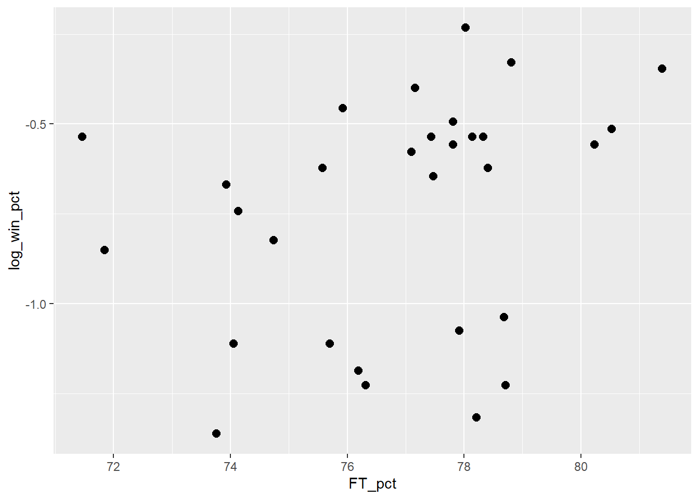

```r
eda_quantitative(nba, "TOV", "log_win_pct")
```

```
## Warning: Use of `data[[explanatory_var]]` is discouraged.
## ℹ Use `.data[[explanatory_var]]` instead.
## Use of `data[[response_var]]` is discouraged.
## ℹ Use `.data[[response_var]]` instead.
```

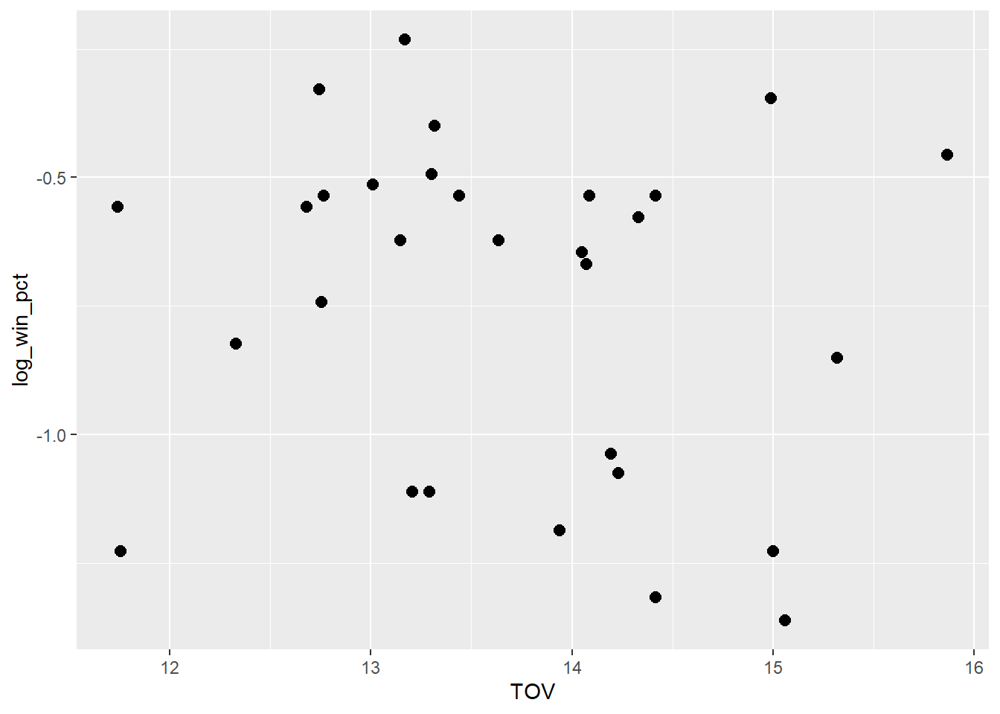

```r
eda_quantitative(nba, "FGA", "log_win_pct")
```

```
## Warning: Use of `data[[explanatory_var]]` is discouraged.
## ℹ Use `.data[[explanatory_var]]` instead.
## Use of `data[[response_var]]` is discouraged.
## ℹ Use `.data[[response_var]]` instead.
```

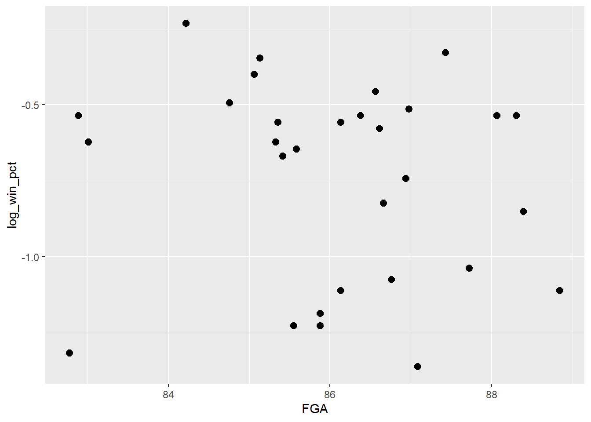

```r
eda_quantitative(nba, "FG", "log_win_pct")
```

```
## Warning: Use of `data[[explanatory_var]]` is discouraged.
## ℹ Use `.data[[explanatory_var]]` instead.
## Use of `data[[response_var]]` is discouraged.
## ℹ Use `.data[[response_var]]` instead.
```


```r
eda_quantitative(nba, "attempts_3P", "log_win_pct")
```

```
## Warning: Use of `data[[explanatory_var]]` is discouraged.
## ℹ Use `.data[[explanatory_var]]` instead.
## Use of `data[[response_var]]` is discouraged.
## ℹ Use `.data[[response_var]]` instead.
```

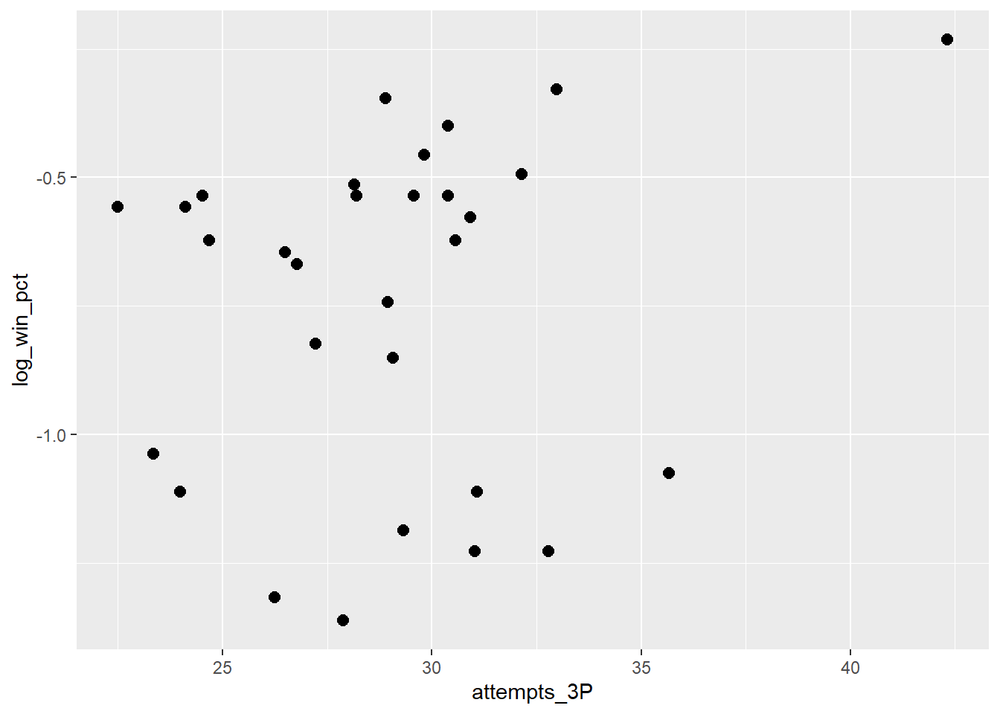

```r
eda_quantitative(nba, "avg_3P_pct", "log_win_pct")
```

```
## Warning: Use of `data[[explanatory_var]]` is discouraged.
## ℹ Use `.data[[explanatory_var]]` instead.
## Use of `data[[response_var]]` is discouraged.
## ℹ Use `.data[[response_var]]` instead.
```

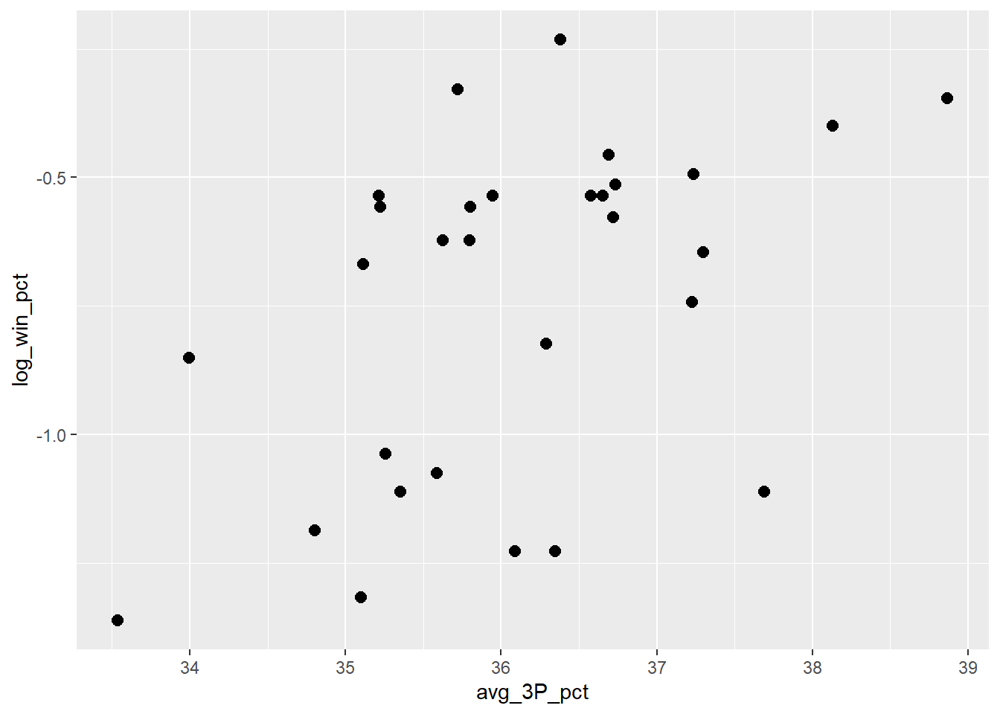

```r
eda_quantitative(nba, "PTS", "log_win_pct")
```

```
## Warning: Use of `data[[explanatory_var]]` is discouraged.
## ℹ Use `.data[[explanatory_var]]` instead.
## Use of `data[[response_var]]` is discouraged.
## ℹ Use `.data[[response_var]]` instead.
```

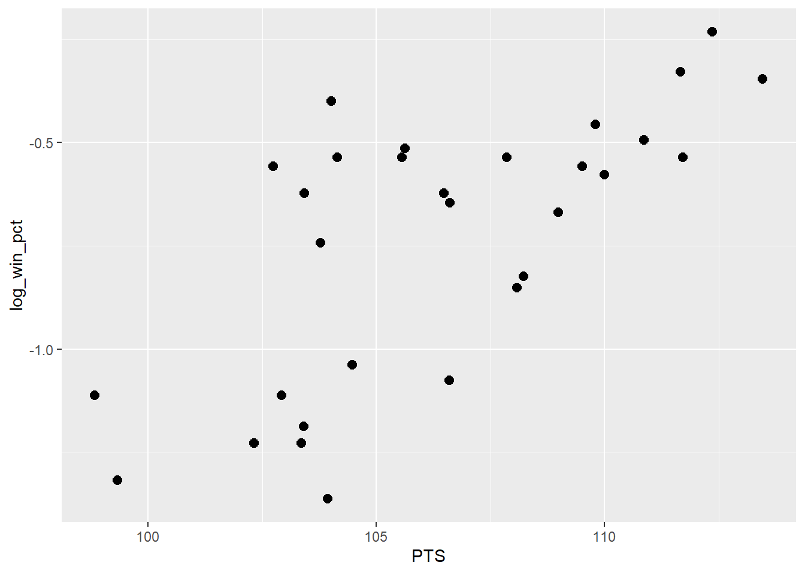

```r
eda_quantitative(nba, "OREB", "log_win_pct")
```

```
## Warning: Use of `data[[explanatory_var]]` is discouraged.
## ℹ Use `.data[[explanatory_var]]` instead.
## Use of `data[[response_var]]` is discouraged.
## ℹ Use `.data[[response_var]]` instead.
```

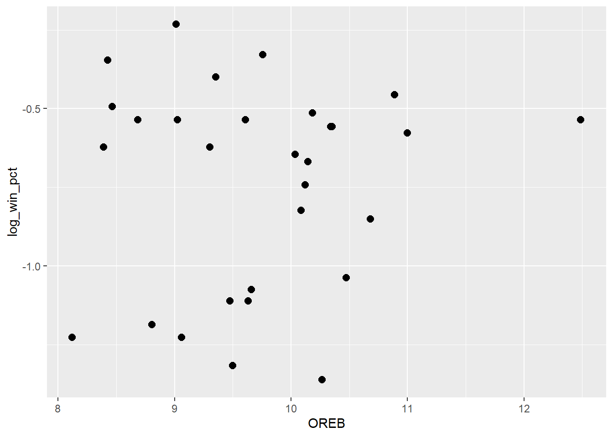

```r
eda_quantitative(nba, "DREB", "log_win_pct")
```

```
## Warning: Use of `data[[explanatory_var]]` is discouraged.
## ℹ Use `.data[[explanatory_var]]` instead.
## Use of `data[[response_var]]` is discouraged.
## ℹ Use `.data[[response_var]]` instead.
```

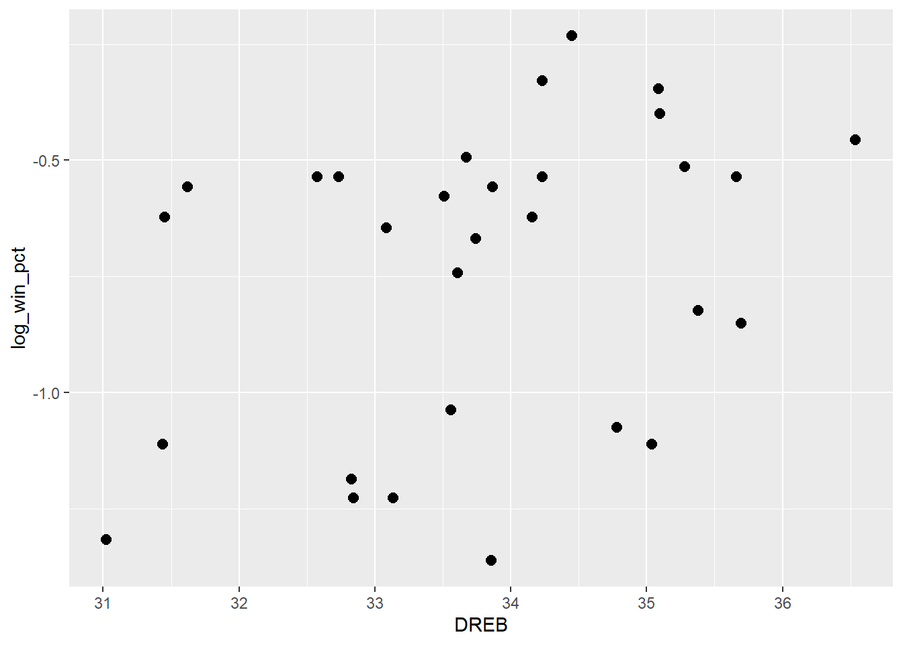

```r
eda_quantitative(nba, "REB", "log_win_pct")
```

```
## Warning: Use of `data[[explanatory_var]]` is discouraged.
## ℹ Use `.data[[explanatory_var]]` instead.
## Use of `data[[response_var]]` is discouraged.
## ℹ Use `.data[[response_var]]` instead.
```


```r
eda_quantitative(nba, "AST", "log_win_pct")
```

```
## Warning: Use of `data[[explanatory_var]]` is discouraged.
## ℹ Use `.data[[explanatory_var]]` instead.
## Use of `data[[response_var]]` is discouraged.
## ℹ Use `.data[[response_var]]` instead.
```


```r
eda_quantitative(nba, "STL", "log_win_pct")
```

```
## Warning: Use of `data[[explanatory_var]]` is discouraged.
## ℹ Use `.data[[explanatory_var]]` instead.
## Use of `data[[response_var]]` is discouraged.
## ℹ Use `.data[[response_var]]` instead.
```


```r
eda_quantitative(nba, "BLK", "log_win_pct")
```

```
## Warning: Use of `data[[explanatory_var]]` is discouraged.
## ℹ Use `.data[[explanatory_var]]` instead.
## Use of `data[[response_var]]` is discouraged.
## ℹ Use `.data[[response_var]]` instead.
```


```r
eda_quantitative(nba, "PF", "log_win_pct")
```

```
## Warning: Use of `data[[explanatory_var]]` is discouraged.
## ℹ Use `.data[[explanatory_var]]` instead.
## Use of `data[[response_var]]` is discouraged.
## ℹ Use `.data[[response_var]]` instead.
```


```r
eda_quantitative(nba, "attempts_2P", "log_win_pct")
```

```
## Warning: Use of `data[[explanatory_var]]` is discouraged.
## ℹ Use `.data[[explanatory_var]]` instead.
## Use of `data[[response_var]]` is discouraged.
## ℹ Use `.data[[response_var]]` instead.
```


```r
summary(nba)
```

```
##      TEAM                Win           win_pct           FT_pct     
##  Length:30          Min.   :21.00   Min.   :0.2560   Min.   :71.46  
##  Class :character   1st Qu.:28.25   1st Qu.:0.3442   1st Qu.:75.61  
##  Mode  :character   Median :44.00   Median :0.5370   Median :77.45  
##                     Mean   :41.00   Mean   :0.5000   Mean   :76.86  
##                     3rd Qu.:48.00   3rd Qu.:0.5850   3rd Qu.:78.30  
##                     Max.   :65.00   Max.   :0.7930   Max.   :81.39  
##       TOV             FGA              FG         attempts_3P   
##  Min.   :11.74   Min.   :82.78   Min.   :43.58   Min.   :22.50  
##  1st Qu.:13.05   1st Qu.:85.34   1st Qu.:45.06   1st Qu.:26.57  
##  Median :13.54   Median :86.13   Median :45.90   Median :29.01  
##  Mean   :13.68   Mean   :86.06   Mean   :46.11   Mean   :29.00  
##  3rd Qu.:14.30   3rd Qu.:86.97   3rd Qu.:47.26   3rd Qu.:30.84  
##  Max.   :15.87   Max.   :88.84   Max.   :50.34   Max.   :42.32  
##    avg_3P_pct         PTS              OREB             DREB      
##  Min.   :33.54   Min.   : 98.83   Min.   : 8.122   Min.   :31.02  
##  1st Qu.:35.28   1st Qu.:103.50   1st Qu.: 9.034   1st Qu.:32.90  
##  Median :36.02   Median :106.05   Median : 9.646   Median :33.80  
##  Mean   :36.10   Mean   :106.33   Mean   : 9.712   Mean   :33.81  
##  3rd Qu.:36.71   3rd Qu.:109.38   3rd Qu.:10.247   3rd Qu.:34.97  
##  Max.   :38.87   Max.   :113.46   Max.   :12.488   Max.   :36.54  
##       REB             AST             STL             BLK       
##  Min.   :39.84   Min.   :19.50   Min.   :6.244   Min.   :3.524  
##  1st Qu.:42.19   1st Qu.:22.22   1st Qu.:7.390   1st Qu.:4.259  
##  Median :43.81   Median :22.78   Median :7.659   Median :4.768  
##  Mean   :43.52   Mean   :23.24   Mean   :7.716   Mean   :4.815  
##  3rd Qu.:44.45   3rd Qu.:23.72   3rd Qu.:8.006   3rd Qu.:5.131  
##  Max.   :47.43   Max.   :29.29   Max.   :9.061   Max.   :7.463  
##        PF         attempts_2P         Loss        log_win_pct     
##  Min.   :17.17   Min.   :41.90   Min.   :17.00   Min.   :-1.3626  
##  1st Qu.:19.15   1st Qu.:54.70   1st Qu.:34.00   1st Qu.:-1.0665  
##  Median :19.60   Median :57.72   Median :38.00   Median :-0.6218  
##  Mean   :19.85   Mean   :57.06   Mean   :41.00   Mean   :-0.7414  
##  3rd Qu.:20.57   3rd Qu.:59.29   3rd Qu.:53.75   3rd Qu.:-0.5361  
##  Max.   :23.17   Max.   :64.38   Max.   :61.00   Max.   :-0.2319
```

```r
library(corrplot)
```

```
## corrplot 0.92 loaded
```

```r
nba <- subset(nba, select = -c(1))

cor_plot = cor(nba)

corrplot(cor_plot, method = 'number', type = 'upper')
```

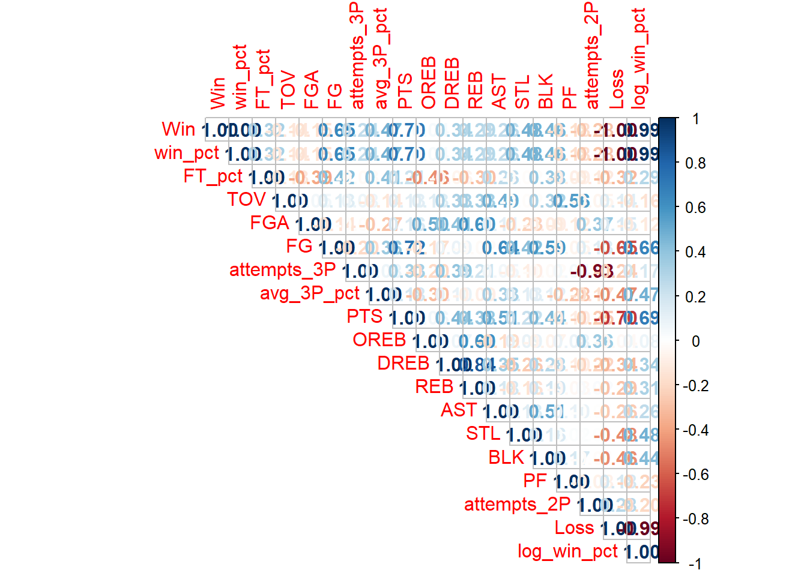


```r
nba.model0 <- glm(win_pct ~ FG, family = binomial, data = nba, weight = (Win+Loss))
```

```
## Warning in eval(family$initialize): non-integer #successes in a binomial glm!
```

```r
nba.model1 <- glm(win_pct ~ FG + PTS, family = binomial, data = nba, weight = (Win+Loss))
```

```
## Warning in eval(family$initialize): non-integer #successes in a binomial glm!
```

```r
nba.model2 <- glm(win_pct ~ FG + PTS + BLK, family = binomial, data = nba, weight = (Win+Loss))
```

```
## Warning in eval(family$initialize): non-integer #successes in a binomial glm!
```

```r
nba.model3 <- glm(win_pct ~ FG + PTS + BLK + avg_3P_pct, family = binomial, data = nba, weight = (Win+Loss))
```

```
## Warning in eval(family$initialize): non-integer #successes in a binomial glm!
```


```r
drop_in_dev0 <- anova(nba.model0, nba.model1, test = "Chisq")
drop_in_dev1 <- anova(nba.model1, nba.model2, test = "Chisq")
drop_in_dev2 <- anova(nba.model2, nba.model3, test = "Chisq")
drop_in_dev3 <- anova(nba.model0, nba.model3, test = "Chisq")

print(drop_in_dev0)
```

```
## Analysis of Deviance Table
## 
## Model 1: win_pct ~ FG
## Model 2: win_pct ~ FG + PTS
##   Resid. Df Resid. Dev Df Deviance  Pr(>Chi)    
## 1        28     127.90                          
## 2        27     102.88  1   25.019 5.678e-07 ***
## ---
## Signif. codes:  0 '***' 0.001 '**' 0.01 '*' 0.05 '.' 0.1 ' ' 1
```

```r
print(drop_in_dev1)
```

```
## Analysis of Deviance Table
## 
## Model 1: win_pct ~ FG + PTS
## Model 2: win_pct ~ FG + PTS + BLK
##   Resid. Df Resid. Dev Df Deviance Pr(>Chi)
## 1        27     102.88                     
## 2        26     100.37  1   2.5152   0.1128
```

```r
print(drop_in_dev2)
```

```
## Analysis of Deviance Table
## 
## Model 1: win_pct ~ FG + PTS + BLK
## Model 2: win_pct ~ FG + PTS + BLK + avg_3P_pct
##   Resid. Df Resid. Dev Df Deviance  Pr(>Chi)    
## 1        26    100.369                          
## 2        25     75.834  1   24.536 7.295e-07 ***
## ---
## Signif. codes:  0 '***' 0.001 '**' 0.01 '*' 0.05 '.' 0.1 ' ' 1
```

```r
print(drop_in_dev3)
```

```
## Analysis of Deviance Table
## 
## Model 1: win_pct ~ FG
## Model 2: win_pct ~ FG + PTS + BLK + avg_3P_pct
##   Resid. Df Resid. Dev Df Deviance  Pr(>Chi)    
## 1        28    127.903                          
## 2        25     75.834  3   52.069 2.895e-11 ***
## ---
## Signif. codes:  0 '***' 0.001 '**' 0.01 '*' 0.05 '.' 0.1 ' ' 1
```

We can see a significant chi val to show that the new model is better for every new predictor except for BLK.


```r
nba.model4 <- glm(win_pct ~ FG + PTS + avg_3P_pct, family = binomial, data = nba, weight = (Win+Loss))
```

```
## Warning in eval(family$initialize): non-integer #successes in a binomial glm!
```

```r
drop_in_dev4 <- anova(nba.model3, nba.model4, test = "Chisq")

print(drop_in_dev4)
```

```
## Analysis of Deviance Table
## 
## Model 1: win_pct ~ FG + PTS + BLK + avg_3P_pct
## Model 2: win_pct ~ FG + PTS + avg_3P_pct
##   Resid. Df Resid. Dev Df Deviance Pr(>Chi)  
## 1        25     75.834                       
## 2        26     81.385 -1  -5.5514  0.01847 *
## ---
## Signif. codes:  0 '***' 0.001 '**' 0.01 '*' 0.05 '.' 0.1 ' ' 1
```
We see significant evidence that the model is better without BLK.


```r
residuals <- residuals(nba.model4, type = "response")

pearson_residuals <- residuals / sqrt(1 / fitted(nba.model4) + 1 / (1 - fitted(nba.model4)))

dispersion_statistic <- sum(pearson_residuals^2) / df.residual(nba.model4)

print(dispersion_statistic)
```

```
## [1] 0.002116952
```

No evidence of overdispersion in model.


```r
summary(nba.model4)
```

```
## 
## Call:
## glm(formula = win_pct ~ FG + PTS + avg_3P_pct, family = binomial, 
##     data = nba, weights = (Win + Loss))
## 
## Deviance Residuals: 
##     Min       1Q   Median       3Q      Max  
## -2.4864  -1.1759  -0.3839   1.5753   3.5767  
## 
## Coefficients:
##              Estimate Std. Error z value Pr(>|z|)    
## (Intercept) -18.95231    1.77834 -10.657  < 2e-16 ***
## FG            0.06060    0.04341   1.396    0.163    
## PTS           0.08944    0.01629   5.492 3.98e-08 ***
## avg_3P_pct    0.18427    0.03995   4.612 3.99e-06 ***
## ---
## Signif. codes:  0 '***' 0.001 '**' 0.01 '*' 0.05 '.' 0.1 ' ' 1
## 
## (Dispersion parameter for binomial family taken to be 1)
## 
##     Null deviance: 218.069  on 29  degrees of freedom
## Residual deviance:  81.385  on 26  degrees of freedom
## AIC: 232.39
## 
## Number of Fisher Scoring iterations: 4
```

```r
# Extract p-values for each coefficient
p_values <- summary(nba.model4)$coefficients[, "Pr(>|z|)"]

# Display the results
result_table <- data.frame(
  Coefficient = names(coef(nba.model4)),
  Estimate = coef(nba.model4),
  P_value = p_values
)

# Display the result table
print(result_table)
```

```
##             Coefficient     Estimate      P_value
## (Intercept) (Intercept) -18.95231204 1.612211e-26
## FG                   FG   0.06060067 1.626821e-01
## PTS                 PTS   0.08943644 3.980551e-08
## avg_3P_pct   avg_3P_pct   0.18426753 3.988065e-06
```

All predictors are significant in this model.

